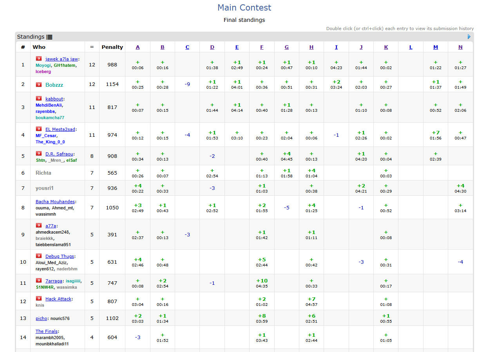

I proudly participated in Arcane Clash, a competitive programming contest held on April 13, 2025, and organized by our university's tech club. This edition was larger than ever, bringing together teams from multiple universities. Competing as part of a three-member team, we were thrilled to secure 10th place among a highly talented pool of participants. The event was a remarkable experience, combining challenge, collaboration, and community spirit.

contest link:

https://codeforces.com/group/6gBRskFznZ/contest/603088
